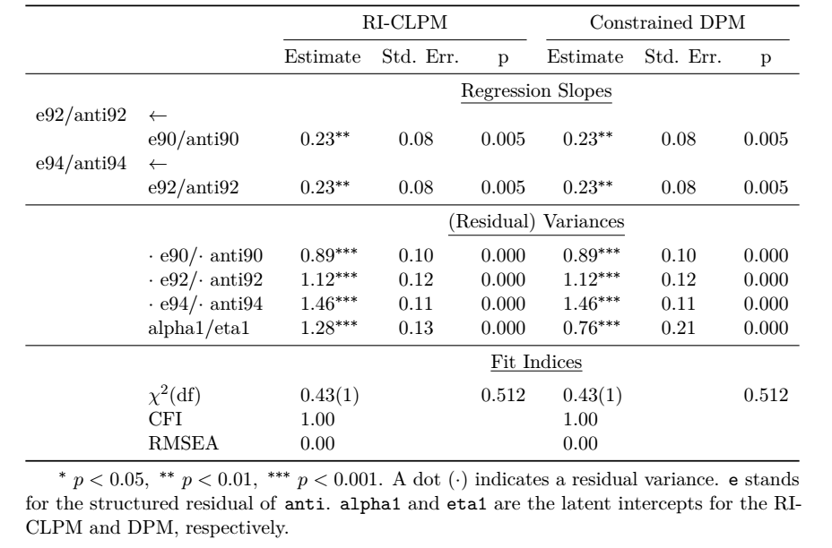

```{r setup, include=FALSE}
knitr::opts_chunk$set(echo = FALSE)

# Script hooks for chunk outputs
source("../scripthooks.R")
```

# Introduction

## Introduction {.allowframebreaks}

- When the Coronavirus pandemic has subsided, **climate change** will likely return as a central pressing issue
- Central to fighting climate change and avoiding climate-related crises is **changing individual behaviour** 
- Some (mixed) evidence for environmental attitudes affecting pro-environmental behaviour
- Most studies correlational in nature, a whole range of theoretical and methodological challenges for investigating this issue 
- Question of **whether attitudes causally affect behaviour** is not sufficiently answered

\framebreak

- We investigate this question in a **longitudinal design**
  + Allows us to control for **unobserved time-invariant confounders**
  + Introducing temporal lags lets us investigate **causal predominance**
- Structural equation modeling (SEM) has advantages in for this topic
  + Attitudes and (to a lesser extent) behaviour are difficult to observe/measure with survey data
  + SEM lets us account for **measurement error** and gets us closer to underlying constructs of interest
  + **Range of very flexible models**: fixed (FE) and random effects (RE), latent curve models (LCM), cross-lagged panel models (CLPM), dynmaic panel models (DPM)
  + Lets us build models according to theory with (relative) ease 
  
\framebreak

- We use the topic of environmental attitudes and behaviour to look at some current methodological topics/debates in SEM 
- Focus on one in particular: 
  + Fixed and random effects models with time-varying covariates: do we specify the effects of interest at the **observation/construct level**, or at the **residual-level** as advocated by the very popular Random-Intercept Cross-Lagged Panel Model (RI-CLPM) and Latent Curve Model with Structured Residuals (LCM-SR)
  + Also touch on measurement invariance, model fit, categorical indicators, etc.
- Show some preliminary findings on whether attitudes "cause" behaviours at the intra- or within-individual level 
  
# Background

## Background {.allowframebreaks}

- Fighting climate change depends on individuals modifying their behaviour [@Barr2007], e.g., consuming less meat, driving less, buying regional and seasonal products, installing and buying more energy efficient home components, paying higher taxes, etc. 
- **But how do we modify behaviour?**
- Two main explanations: 
  + raising awareness (cognitive, normative), i.e., **changing attitudes**
  + providing behavioural alternatives, i.e., situational or **low-cost hypothesis** [@Barr2007; @Best2011] 
- Likely both play a role and even interact with each other [@Best2011] 

\framebreak

- We focus on **environmental attitudes** using observational (longitudinal) data and whether positive attitudes lead to more environmentally friendly behaviour
- Environmental attitudes can be described as the **overall evaluation of the environment** or state of environment as well as **enduring emotional or cognitive processes** associated with the environment [@Eilam2012]

\framebreak

Why re-examine this topic? 

- Unresolved questions: 
  + **do changes in one's attitudes *causally* affect one's behaviour**? 
  + or are associations between attitudes and behaviour **set by stable between-person differences**? 
- If the former is true, then attitudes and behaviour can potentially be changed via policy aimed at attitude change
- If the latter is true, then behaviour is set by relatively stable personality-/values-/milieu-related unobservables. Changing attitudes without changing underlying stable characteristics will not change behaviour
  
\framebreak  
  
- So, if attitudes affect behaviour, then policy should focus on informing the public
- However, evidence for the environmental attitude-behaviour link is mixed, e.g., **heterogeneous effects** depending on the **type of behaviour** (e.g., recycling vs. transport vs. willingness to pay) 
- Also, studying the relationship is fraught with **unobserved confounders** [@Barr2007], e.g., psychological factors, intrinsic motivation, income, education, etc. and most studies are **cross-sectional and observational**  

\framebreak

- It is not even clear from the literature whether **attitudes cause behaviour or behaviour may actually cause attitudes** [@Eilam2012]
- Potentially a mix of both
- Due to **cognitive dissonance**, when one's behaviour changes (initially unrelated to an attitudinal change) attitudes may fall in line to conform with behaviour
- Cross-lagged models or, more generally, models that account for **reverse causality** allow us to investigate causal predominance, i.e., does $x$ lead to $y$ or does $y$ lead to $x$? 

\framebreak 

- Besides reverse causality, it could be that previous behaviour also affects future behaviour, i.e., the **behavioural snowball** effect [@Barr2007]

# Modeling Strategy

## Modeling strategy {.allowframebreaks}

- Based on these points, we would like to apply **panel regression models** with 
  + fixed effects to account for **unobserved time-invariant confounders**
  + autoregressive effects to account for the so-called **snowball effect**
  + reverse causality to investigate **causal predominance** or rather **direction of causation**
  + multi-indicator measurement models to account for **measurement error** in the assumed independent variables
  
\framebreak

\begin{figure}
\centering
\begin{tikzpicture}
\tikzstyle{man} = [rectangle, thick, minimum size = 1cm, draw = black!80, fill = white!100, font = \sffamily, align=center] 
\tikzstyle{lat} = [circle, thick, minimum size = 1cm, draw = black!80, fill = white!100, font = \sffamily, align=center] 
\tikzstyle{err} = [circle, draw = black!80, fill = white!100, font = \sffamily] 
\tikzstyle{con} = [-latex, font = \sffamily] 
\tikzstyle{cons} = [-latex, font = \sffamily\small] 
\tikzstyle{cor} = [latex-latex, font = \sffamily] 
\node at (+0.0,+0.0) [man] (y1) {behav$_{t1}$}; 
\node at (+2.0,+0.0) [man] (y2) {behav$_{t2}$};
\node at (+4.0,+0.0) [man] (y3) {behav$_{t3}$}; 
\node at (+2.0,+2.0) [lat] (eta) {\footnotesize stable \\charac-\\teristics}; 
\node at (+0.0,-1.5) [err, draw = white!100, fill = white!100, text = white!100] (e1) {$\varepsilon_{0}$}; 
\node at (+2.0,-1.5) [err] (e2) {$\varepsilon_{2}$};
\node at (+4.0,-1.5) [err] (e3) {$\varepsilon_{3}$};
%\node at (+0.0,-3.0) [err, draw = white!100, fill = white!100, text = white!100] (u1) {$\nu_{0}$};
%\node at (+2.0,-3.0) [err, draw = white!100, fill = white!100, text = white!100] (u2) {$\nu_{1}$};
%\node at (+4.0,-3.0) [err, draw = white!100, fill = white!100, text = white!100] (u3) {$\nu_{2}$};
%\path (e1) edge [con, draw = black!100, left] node {1} (y1); 
\path (e2) edge [con, draw = black!100, left] node {1} (y2);
\path (e3) edge [con, draw = black!100, right] node {1} (y3);
\path (eta) edge [cor, draw = black!100, above, bend right] node {} (y1); 
\path (eta) edge [con, draw = black!100, left] node {1} (y2);
\path (eta) edge [con, draw = black!100, above] node {1} (y3);
\path (y1) edge [con, draw = black!100, below] node {$\rho$} (y2);
\path (y2) edge [con, draw = black!100, below] node {$\rho$} (y3);
\end{tikzpicture}
\caption{xxx} \label{fig:dag}
\end{figure}

# Methodological issues

## Methodological issues {.allowframebreaks}

The kitchen sink: 

- Observation- or residual-level model?
- One- or two-sided models?
- Categorical measurement models and measurement invariance
- The role of fit?
- Reflective or formative indicators
- Missing values

\framebreak

The kitchen sink: 

- **Observation- or residual-level model?**
- \textcolor{gray}{One- or two-sided models?}
- \textcolor{gray}{Categorical measurement models and measurement invariance}
- \textcolor{gray}{The role of fit?}
- \textcolor{gray}{Reflective or formative indicators}
- \textcolor{gray}{Missing values}

## Observation- vs. residual-level models {.allowframebreaks}

- In the context of modeling reciprocal relations longitudinally, the RI-CLPM [@Hamaker2015] has arguably become the 'gold standard'. 
- According to [Google Scholar](https://scholar.google.com/scholar?hl=en&as_sdt=0%2C5&q=ellen+hamaker&btnG=&oq=ellen+), currently just under 900 citations in six years. In comparison, fundamental texts like @Bollen2004: ["ALT Models. A Synthesis of Two Traditions](https://journals.sagepub.com/doi/abs/10.1177/0049124103260222?casa_token=3QtVXj0sUnsAAAAA:9-MGgbW5tIXaXzkFAd-vEOcEe-zU7R9DquXLOL5Yo_mcoe5J4nEyZjCaV_z2I86oh3qrpy9er_YS) @Curran2001: ["The best of both worlds"](https://psycnet.apa.org/record/2001-01077-004) each have only 400--500 after about 20 years.
- The RI-CLPM and, similarly, the LCM-SR from @Curran2014, are advertised as providing benefits compared to the more conventional (bivariate) ALT models outlined in the articles above by Bollen & Curran. 
- **Which one should we use?**

\framebreak

Some background:

- The DPM and RI-CLPM take **unobserved heterogeneity in terms of level** into account. The ALT and LCM-SR are more general and take stable differences in terms of **both level and trajectory** into account. 
- The RI-CLPM and LCM-SR work by modeling AR and CL effects at the **residual-level**, i.e., what is left over after regressing the observed (or latent) repeated measures on the individual effects. 
- When we fix the regression weights/factor loadings to 1.0 (as we usually do), then we are essentially **demeaning** or **detrending** the data.  

\framebreak

- We need to be clear that the benefit of the residual-level models is that the **between-person trajectories can be interpreted more easily**. 
- This is not made clear enough in the source materials [@Hamaker2015; @Curran2014]. E.g., "if theory posits that the over-time relation between two constructs consists of a unique between-person and a unique within-person component, an alternative parameterization to the ALT and LCM-TVC\footnote{Latent Curve Model with Time-Varying Covariates} is needed" [@Curran2014, p. 884]. 

\framebreak 

- But the models we are talking about **always** consist of unique between- and within-person components.
\begin{align}
y_{it} & = \underbrace{\rho y_{it-1} + \beta x_{it-1}}_{within} + \underbrace{\eta_{i}}_{between} + \underbrace{\varepsilon_{it}}_{within}
\end{align}
- By including the individual effects $\alpha_{i}$, the between-variance in the other terms is partialled out.  
- So, aren't the two approaches, at the observation- and at the residual-level, equivalent? 
 
\framebreak

For the sake of simplicity, consider an **autoregressive model with individual effects** (heterogeneity on level, not growth). This is like a univariate ALT with no slope factor or a DPM. It allows us to look at the differences and similarities between the RI-CLPM and DPM. The conclusions also apply to the LCM-SR and ALT. 

Let us look at such a model with no covariates:
\begin{align}
y_{it} & = \rho y_{it-1} + \eta_{1i} + \nu_{it}, \ t = 1, \ldots, T \label{eq:obs-simple}
\end{align}
where we have observations on $t = 0, \ldots, T$. 

Note that $t = 0$ is the first observation, for which we currently have no equation. 

\framebreak

There are two common ways to deal with $y_{i0}$: 

1. Treat it as **predetermined**, i.e., make no assumptions on the process before the observation period began and allow it to covary freely with the individual effects and any other covariates. 
2. Assume the same process for $t = 1, \ldots, T$ also applies to the previous unobserved periods: this is often referred to as the **constrained** ALT.

The constrained ALT has the benefit of **parsimony** compared to the predetermined ALT. If the assumptions about the process before the observation period began hold, then we can work out a **fixed value for the first factor loading** $\eta_{1i} \rightarrow y_{i0}$ and save a degree of freedom (or several df in specifications with slopes). 

\framebreak

\begin{figure}
\centering
\begin{subfigure}{0.4\textwidth}
\centering
\begin{tikzpicture}
\tikzstyle{man} = [rectangle, thick, minimum size = 1cm, draw = black!80, fill = white!100, font = \sffamily] 
\tikzstyle{lat} = [circle, thick, minimum size = 1cm, draw = black!80, fill = white!100, font = \sffamily] 
\tikzstyle{err} = [circle, draw = black!80, fill = white!100, font = \sffamily] 
\tikzstyle{con} = [-latex, font = \sffamily] 
\tikzstyle{cons} = [-latex, font = \sffamily\small] 
\tikzstyle{cor} = [latex-latex, font = \sffamily] 
\node at (+0.0,+0.0) [man] (y1) {$y_{0}$}; 
\node at (+2.0,+0.0) [man] (y2) {$y_{1}$};
\node at (+4.0,+0.0) [man] (y3) {$y_{2}$}; 
\node at (+2.0,+2.0) [lat] (eta) {$\eta$}; 
\node at (+0.0,-1.5) [err, draw = white!100, fill = white!100, text = white!100] (e1) {$\varepsilon_{0}$}; 
\node at (+2.0,-1.5) [err] (e2) {$\varepsilon_{2}$};
\node at (+4.0,-1.5) [err] (e3) {$\varepsilon_{3}$};
%\node at (+0.0,-3.0) [err, draw = white!100, fill = white!100, text = white!100] (u1) {$\nu_{0}$};
%\node at (+2.0,-3.0) [err, draw = white!100, fill = white!100, text = white!100] (u2) {$\nu_{1}$};
%\node at (+4.0,-3.0) [err, draw = white!100, fill = white!100, text = white!100] (u3) {$\nu_{2}$};
%\path (e1) edge [con, draw = black!100, left] node {1} (y1); 
\path (e2) edge [con, draw = black!100, left] node {1} (y2);
\path (e3) edge [con, draw = black!100, right] node {1} (y3);
\path (eta) edge [cor, draw = black!100, above, bend right] node {} (y1); 
\path (eta) edge [con, draw = black!100, left] node {1} (y2);
\path (eta) edge [con, draw = black!100, above] node {1} (y3);
\path (y1) edge [con, draw = black!100, below] node {$\rho$} (y2);
\path (y2) edge [con, draw = black!100, below] node {$\rho$} (y3);
\end{tikzpicture}
\caption{Predetermined} \label{fig:ar_pre}
\end{subfigure} \hfill
\begin{subfigure}{0.4\textwidth}
\centering
\begin{tikzpicture}
\tikzstyle{man} = [rectangle, thick, minimum size = 1cm, draw = black!80, fill = white!100, font = \sffamily] 
\tikzstyle{lat} = [circle, thick, minimum size = 1cm, draw = black!80, fill = white!100, font = \sffamily] 
\tikzstyle{err} = [circle, draw = black!80, fill = white!100, font = \sffamily] 
\tikzstyle{con} = [-latex, font = \sffamily] 
\tikzstyle{cons} = [-latex, font = \sffamily\small] 
\tikzstyle{cor} = [latex-latex, font = \sffamily] 
\node at (+0.0,+0.0) [man] (y1) {$y_{0}$}; 
\node at (+2.0,+0.0) [man] (y2) {$y_{1}$};
\node at (+4.0,+0.0) [man] (y3) {$y_{2}$}; 
\node at (+2.0,+2.0) [lat] (eta) {$\eta$}; 
\node at (+0.0,-1.5) [err] (e1) {$\varepsilon_{0}$}; 
\node at (+2.0,-1.5) [err] (e2) {$\varepsilon_{1}$};
\node at (+4.0,-1.5) [err] (e3) {$\varepsilon_{2}$};
%\node at (+0.0,-3.0) [err, draw = white!100, fill = white!100, text = white!100] (u1) {$\nu_{0}$};
%\node at (+2.0,-3.0) [err, draw = white!100, fill = white!100, text = white!100] (u2) {$\nu_{1}$};
%\node at (+4.0,-3.0) [err, draw = white!100, fill = white!100, text = white!100] (u3) {$\nu_{2}$};
\path (e1) edge [con, draw = black!100, left] node {1} (y1); 
\path (e2) edge [con, draw = black!100, left] node {1} (y2);
\path (e3) edge [con, draw = black!100, right] node {1} (y3);
\path (eta) edge [con, draw = black!100, left] node {$(1 - \rho)^{-1}$} (y1); 
\path (eta) edge [con, draw = black!100, left] node {1} (y2);
\path (eta) edge [con, draw = black!100, right] node {1} (y3);
\path (y1) edge [con, draw = black!100, below] node {$\rho$} (y2);
\path (y2) edge [con, draw = black!100, below] node {$\rho$} (y3);
\end{tikzpicture}
\caption{Constrained} \label{fig:ar_con}
\end{subfigure} \hfill
\caption{Simplified three-wave AR(1) models with unobserved heterogeneity} \label{fig:ar}
\end{figure}

\framebreak

For the constrained model, we assume the process for $t = 1, \ldots, T$ applies to the previous unobserved time points. 
\begin{align}
y_{i0} & = \rho y_{i,-1} + \eta_{1i} + \nu_{i0} \\
 & = \rho(\rho y_{i,-2} + \eta_{1i} + \nu_{i,-1}) + \eta_{1i} + \nu_{i0} \\
 & = \rho(\rho(\rho y_{i,-3} + \eta_{1i} + \nu_{i,-2}) + \eta_{1i} + \nu_{i,-1}) + \eta_{1i} + \nu_{i0} \\
 & = \rho^{3}y_{i,-3} + \rho^{2}\eta_{1i} + \rho \eta_{1i} + \eta_{1i} + \rho^{2}\nu_{i,-2} + \rho \nu_{i,-1} + \nu_{i0} \\
 & = \ldots
\end{align}
and keep going with this back to $-\infty$. 

\framebreak

This results in 
\begin{align}
y_{i0} & = \sum_{j=0}^{\infty}\rho^{j}\eta_{1i} + \sum_{i=0}^{\infty}\rho^{j}\nu_{i(t - j)}
\end{align}
[@Bollen2004; @Curran2001; @Hamaker2005]. If the autoregressive effect $\rho$ is time-constant and less than 1 in absolute value, then the equation converges to 
\begin{align}
y_{i0} & = (1 - \rho)^{-1}\eta_{1i} + \varepsilon_{i0} \label{eq:const-y0}
\end{align}
and where $\varepsilon_{i0}$ is the weighted sum of the previous residuals [@Jongerling2011]. 

So we set the first factor loading $\eta_{1i} \rightarrow y_{i0}$ to $(1 - \rho)^{-1}$ in the constrained model. 

\framebreak

Now look at the residual-level formulation:
\begin{align}
y_{it} & = \alpha_{1i} + \varepsilon_{it}, \ t = 0, \ldots, T \\
\varepsilon_{it} & = \rho \varepsilon_{it-1} + \nu_{it}, \ t = 1, \ldots, T. 
\end{align}
Substitute the second equation into the first:
\begin{align}
y_{it} & = \alpha_{1i} + \rho \varepsilon_{it-1} + \nu_{it}, \ t = 1, \ldots, T 
\end{align}
and then rewrite the residuals in terms of the observed variables:
\begin{align}
y_{it} & = \alpha_{1i} + \rho(y_{it-1} - \alpha_{1i}) + \nu_{it} \\
& = (1 - \rho)\alpha_{1i} + \rho y_{it-1} + \nu_{it}, \ t = 1, \ldots, T.
\end{align}

\framebreak

\begin{figure}
\centering
\begin{tikzpicture}
\tikzstyle{man} = [rectangle, thick, minimum size = 1cm, draw = black!80, fill = white!100, font = \sffamily] 
\tikzstyle{lat} = [circle, thick, minimum size = 1cm, draw = black!80, fill = white!100, font = \sffamily] 
\tikzstyle{err} = [circle, draw = black!80, fill = white!100, font = \sffamily] 
\tikzstyle{con} = [-latex, font = \sffamily] 
\tikzstyle{cons} = [-latex, font = \sffamily\small] 
\tikzstyle{cor} = [latex-latex, font = \sffamily] 
\node at (+0.0,+0.0) [man] (y1) {$y_{0}$}; 
\node at (+2.0,+0.0) [man] (y2) {$y_{1}$};
\node at (+4.0,+0.0) [man] (y3) {$y_{2}$}; 
\node at (+2.0,+2.0) [lat] (eta) {$\alpha$}; 
\node at (+0.0,-1.5) [err] (e1) {$\varepsilon_{0}$}; 
\node at (+2.0,-1.5) [err] (e2) {$\varepsilon_{1}$};
\node at (+4.0,-1.5) [err] (e3) {$\varepsilon_{2}$};
\node at (+0.0,-3.0) [err, draw = white!100, fill = white!100, text = white!100] (u1) {$\nu_{0}$};
\node at (+2.0,-3.0) [err] (u2) {$\nu_{1}$};
\node at (+4.0,-3.0) [err] (u3) {$\nu_{2}$};
\path (e1) edge [con, draw = black!100, left] node {1} (y1); 
\path (e2) edge [con, draw = black!100, left] node {1} (y2);
\path (e3) edge [con, draw = black!100, right] node {1} (y3);
\path (eta) edge [con, draw = black!100, above] node {1} (y1); 
\path (eta) edge [con, draw = black!100, left] node {1} (y2);
\path (eta) edge [con, draw = black!100, above] node {1} (y3);
\path (e1) edge [con, draw = black!100, below] node {$\rho$} (e2);
\path (e2) edge [con, draw = black!100, below] node {$\rho$} (e3);
\path (u2) edge [con, draw = black!100, left] node {1} (e2); 
\path (u3) edge [con, draw = black!100, left] node {1} (e3); 
\end{tikzpicture}
\caption{Simplified three-wave residual-level AR(1) model with unobserved heterogeneity} \label{fig:ar_res}
\end{figure}

\framebreak

Now, define $\eta_{1i} = (1 - \rho)\alpha_{1i}$ for 
\begin{align}
y_{it} & = \rho y_{it-1} + \eta_{1i} + \nu_{it}, \ t = 1, \ldots, T
\end{align}
which is the observation-level equation for $t = 1, \ldots, T$ from \eqref{eq:obs-simple}. By rearranging, we know $\alpha_{1i} = (1 - \rho)^{-1}\eta_{1i}$, so for $t = 0$, we have
\begin{align}
y_{i0} & = \alpha_{1i} + \varepsilon_{i0} \\
 & = (1 - \rho)^{-1}\eta_{1i} + \nu_{i0}
\end{align}
(since without $\varepsilon_{i,-1}$, $\varepsilon_{i0} = \nu_{i0}$). This is the equation for $y_{i0}$ from the constrained observation-level model shown in Equation \eqref{eq:const-y0}.

\framebreak

- **This shows that we can rewrite the residual-level model as a *constrained* observation-level model.**
- The residual-level models are thus equivalent to their constrained observation-level counterparts in terms of estimated AR and CL parameters, degrees of freedom and model fit. 
- The individual effects in the constrained model are scaled versions of their residual-level model counterparts and can be easily recovered. 
- It can be shown easily using real data. 

\framebreak

For example, take three waves of antisocial behaviour in children from the freely available NLSY study [@Allison2009; @NLSY97]. 

```{r}
library(haven)
nlsy <- read_dta("https://statisticalhorizons.com/wp-content/uploads/nlsy.dta")
```

We model autoregressive effects while accounting for unobserved heterogeneity at the observation- and residual-level. 

The variables are `anti90`, `anti92` and `anti94` for antisocial behaviour measures in 1990, 1992 and 1994. 

\framebreak 

The constrained observation-level model:

```{r warning=FALSE, message=FALSE, echo=TRUE}
library(lavaan)

dpm_con1 <- '
# Identify the individual effects
eta1 =~ 1*anti92 + 1*anti94 + a*anti90
# Regressions, time-invariant effect
anti92 ~ rho*anti90
anti94 ~ rho*anti92
# Constraints 
a == (1 - rho)^-1
'
dpm_con1.fit <- sem(model = dpm_con1, data = nlsy)
```

\framebreak

And the residual-level model:

\scriptsize
```{r echo=TRUE}
riclpm1 <- '
# Identify the individual effects
alpha1 =~ 1*anti90 + 1*anti92 + 1*anti94
# Identify the residuals as new latent variables
e90 =~ 1*anti90
e92 =~ 1*anti92
e94 =~ 1*anti94
# Set variance of the observed variables to zero
anti90 ~~ 0*anti90
anti92 ~~ 0*anti92
anti94 ~~ 0*anti94
# Regressions, time-invariant effect 
e92 ~ rho*e90
e94 ~ rho*e92
# Constrain covariance alpha1 and e1 to zero (override default)
alpha1 ~~ 0*e90 
'
riclpm1.fit <- sem(model = riclpm1, data = nlsy)
```
\normalsize

\framebreak

{width=60%}

Notice the AR effects (size, standard error, p-value), degrees of freedom and model fit are all identical in both models. These results can be shown to generalize to models with latent slopes, see [this preprint](https://github.com/henrik-andersen/equivalent-approaches/blob/main/article.pdf) (currently under review), as well as @Ou2016. 

The problem is that **there are situations in which the assumptions necessary to derive the constraints for $t = 0$ are not appropriate**. 

\framebreak

Crucially, the constrained observation-level models and thus also the residual-level models assume the covariance between the initial observation and the individual effects is 
\begin{align}
\Cov(y_{i0},\alpha_{1i}) & = \Var(\alpha_{1i}), & \ \text{or, alternatively} \\
\Cov(y_{i0},\eta_{1i})   & = (1 - \rho)^{-1}\Var(\eta_{1i}). & 
\end{align}
However, **it takes time for this covariance to set in**, and it is based on the assumption that **the AR effects are less than 1 in absolute value** and are **constant over time**. 

\framebreak

For example, assume the model 
\begin{align}
y_{it} & = \rho y_{it-1} + \eta_{1i} + \nu_{it}
\end{align}
and for the very first realization (independent of our observations), it is $y_{i0} = \eta_{1i} + \nu_{i0}$. 

\framebreak

```{r echo=TRUE}
# Set some parameters
n <- 100000
rho <- 0.5
# Generate the data 
eta1 <- rnorm(n, 0, 1)
y0 <- eta1 + rnorm(n, 0, 1)
y1 <- rho*y0 + eta1 + rnorm(n, 0, 1)
y2 <- rho*y1 + eta1 + rnorm(n, 0, 1)
y3 <- rho*y2 + eta1 + rnorm(n, 0, 1)
y4 <- rho*y3 + eta1 + rnorm(n, 0, 1)

df <- data.frame(eta1, y0, y1, y2, y3, y4)
```

\framebreak

We know the covariance between the observations and individual effects (in the population) converges to $\Cov(y_{it},\eta_{1i}) = (1 - \rho)^{-1}\Var(\eta_{1i}) = (1 - 0.5)^{-1}(1) = 2$.

```{r echo=TRUE}
cov(df)
```

After five realizations, the covariance is `r round(cov(df$y4, df$eta1), 3)`. After two realizations, though, it is only `r round(cov(df$y1, df$eta1), 3)`, for example. 

\framebreak

\begin{columns}
\begin{column}{0.48\textwidth}
\begin{figure}
\centering
\begin{tikzpicture}
\tikzstyle{man} = [rectangle, thick, minimum size = 1cm, draw = black!80, fill = white!100, font = \sffamily] 
\tikzstyle{lat} = [circle, thick, minimum size = 1cm, draw = black!80, fill = white!100, font = \sffamily] 
\tikzstyle{err} = [circle, draw = black!80, fill = white!100, font = \sffamily] 
\tikzstyle{con} = [-latex, font = \sffamily] 
\tikzstyle{cons} = [-latex, font = \sffamily\small] 
\tikzstyle{cor} = [latex-latex, font = \sffamily] 
\node at (+0.0,+0.0) [man] (y1) {$y_{1}$}; 
\node at (+2.0,+0.0) [man] (y2) {$y_{2}$};
%\node at (+4.0,+0.0) [man] (y3) {$y_{2}$}; 
\node at (+1.0,+2.0) [lat] (eta) {$\eta$}; 
\node at (+0.0,-1.5) [err] (e1) {$\varepsilon_{1}$}; 
\node at (+2.0,-1.5) [err] (e2) {$\varepsilon_{2}$};
%\node at (+4.0,-1.5) [err] (e3) {$\varepsilon_{2}$};
%\node at (+0.0,-3.0) [err, draw = white!100, fill = white!100, text = white!100] (u1) {$\nu_{0}$};
%\node at (+2.0,-3.0) [err] (u2) {$\nu_{1}$};
%\node at (+4.0,-3.0) [err] (u3) {$\nu_{2}$};
\path (e1) edge [con, draw = black!100, left] node {1} (y1); 
\path (e2) edge [con, draw = black!100, left] node {1} (y2);
%\path (e3) edge [con, draw = black!100, right] node {1} (y3);
\path (eta) edge [con, draw = black!100, left] node {$x$} (y1); 
\path (eta) edge [con, draw = black!100, right] node {1} (y2);
%\path (eta) edge [con, draw = black!100, above] node {1} (y3);
\path (y1) edge [con, draw = black!100, below] node {$\rho$} (y2);
%\path (e2) edge [con, draw = black!100, below] node {$\rho$} (e3);
%\path (u2) edge [con, draw = black!100, left] node {1} (e2); 
%\path (u3) edge [con, draw = black!100, left] node {1} (e3); 
\end{tikzpicture}
\caption{Autoregressive effect depends on factor loadings} \label{fig:ex1}
\end{figure}
\end{column}
\begin{column}{0.48\textwidth}
Fixing the first factor loading to $x = (1 - \rho)^{-1}$ or, equivalently, running a residual-level model like the RI-CLPM or LCM-SR is only appropriate when
\begin{itemize}
\item the data is stationary, 
\item the process has been going on long enough to have reached equilibrium and 
\item has not been temporarily 'knocked' out of equilibrium (e.g., by an intervention) 
\end{itemize}
\end{column}
\end{columns}

\framebreak

Obviously, $\Cov(y_{1},\eta) \ne (1 - \rho)^{-1}\Var(\eta)$, but rather $\Cov(y_{1},\eta) = \rho\Var(\eta) + \Var(\eta)$. In the simulated example here, the actual covariance is around 1.5, but the constrained model wou

\framebreak

Here, for example the constrained model overestimates the AR effect substantially:

```{r eval=FALSE, echo=TRUE, warning=FALSE, error=FALSE, message=FALSE}
# Run a three-wave constrained ALT (otherwise unidentified) 
ex1 <- '
alpha =~ 1*y2 + 1*y3 + a*y1
y3 ~ rho*y2
y2 ~ rho*y1
a == (1 - rho)^-1
'
ex1.fit <- sem(ex1, data = df)
summary(ex1.fit)
```

\framebreak

Here, for example the constrained model overestimates the AR effect substantially:

```{r warning=FALSE, error=FALSE, message=FALSE, output.lines=28:33}
# Run a three-wave constrained ALT (otherwise unidentified) 
ex1 <- '
alpha =~ 1*y2 + 1*y3 + a*y1
y3 ~ rho*y2
y2 ~ rho*y1
a == (1 - rho)^-1
'
ex1.fit <- sem(ex1, data = df)
summary(ex1.fit)
```

\framebreak

Now, the predetermined model:

```{r eval=FALSE, echo=TRUE, warning=FALSE, error=FALSE, message=FALSE}
# Run a three-wave predetermined ALT (otherwise unidentified) 
ex2 <- '
alpha =~ 1*y2 + 1*y3 
y3 ~ rho*y2
y2 ~ rho*y1
alpha ~~ y1
'
ex2.fit <- sem(ex2, data = df)
summary(ex2.fit)
```

\framebreak

Now, the predetermined model:

```{r warning=FALSE, error=FALSE, message=FALSE, output.lines=28:33}
# Run a three-wave predetermined ALT (otherwise unidentified) 
ex2 <- '
alpha =~ 1*y2 + 1*y3 
y3 ~ rho*y2
y2 ~ rho*y1
alpha ~~ y1
'
ex2.fit <- sem(ex2, data = df)
summary(ex2.fit)
```

# Analysis


# Conclusion

## Conclusion {.allowframebreaks}

Some issues: 

- Panel models with latent variables and measurement models become very cumbersome to code, especially when
    + the number of indicators per latent construct is large
    + the number of waves of observations is large
- FIML for categorical data [does not seem to be supported in `lavaan` at the moment](https://groups.google.com/g/lavaan/c/PXKNAvYqXcw): we lose a large number of observations due to this 
- Modeling sequential exogeneity seems to boost the effects of interest. Why? This was observed in a [preliminary results](https://www.researchgate.net/publication/348548953_The_impact_of_social_isolation_on_subjective_well-being) of a study of Seifert & Andersen. **Why is this?**

\framebreak

Some (more) issues:

- Nothing new, but measurement invariance tends to reduce model fit. Publishing results could be eased by **more awareness for the fact that strict invariance (scalar or threshold) is the default assumption of non-SEM methods**. 

# References

## References {.allowframebreaks}
